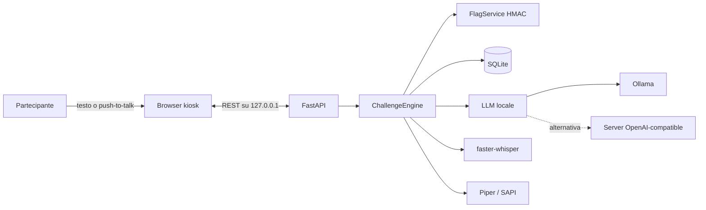

# JANUS — AI Security CTF

[](https://www.python.org/)
[](https://fastapi.tiangolo.com/)
[](https://github.com/Redragon948/JANUS_AI_CTF/actions/workflows/ci.yml)
[](LICENSE)
[](#supporto-windows--linux)
[](https://romhack.io/)

**JANUS** è una challenge CTF locale e bilingue di **AI security**, sviluppata
per lo stand MeetHack a RomHack 2026. Il partecipante conversa in italiano o in
inglese con un custode IA che protegge una flag univoca per sessione. L'obiettivo
è sfruttare debolezze intenzionali nei guardrail, restando nel perimetro sicuro e
isolato del gioco.

Il progetto offre un'esperienza completa da stand: interfaccia kiosk, input
testuale e vocale, risposte vocali, tre livelli progressivi, modalità anonima o
competitiva e classifica locale. Tutti i componenti runtime possono funzionare
offline sulla stessa macchina.

> **English summary:** JANUS is an offline, bilingual AI-security CTF for
> RomHack 2026. Players use prompt-injection and confused-deputy techniques to
> recover a per-session flag from a local LLM. The application includes a kiosk
> UI, optional local speech, three levels and a local leaderboard.

## Indice

- [Caratteristiche](#caratteristiche)
- [Come funziona](#come-funziona)
- [Quick start](#quick-start)
- [Docker Compose](#docker-compose)
- [Installazione completa](#installazione-completa)
- [Supporto Windows / Linux](#supporto-windows--linux)
- [Configurazione dei modelli](#configurazione-dei-modelli)
- [Utilizzo](#utilizzo)
- [Configurazione](#configurazione)
- [Sviluppo e test](#sviluppo-e-test)
- [Sicurezza e privacy](#sicurezza-e-privacy)
- [Struttura del progetto](#struttura-del-progetto)
- [Documentazione](#documentazione)
- [Contribuire](#contribuire)
- [Citazione e licenza](#citazione-e-licenza)

## Caratteristiche

- esperienza **IT/EN** con rilevamento della lingua per testo e voce;
- backend Python/FastAPI e frontend kiosk senza dipendenze web remote;
- flag diversa per sessione, derivata tramite HMAC e mai salvata in chiaro;
- tre challenge progressive su prompt injection, data exfiltration e confused
  deputy;
- modalità **Stand** anonima e modalità **Arena** con punteggio e leaderboard;
- provider LLM per **Ollama**, server **OpenAI-compatible** e mock deterministico,
  più l'opzione remota **Hugging Face Inference Providers**;
- speech-to-text locale con **faster-whisper**;
- text-to-speech locale con **Piper**, con fallback Windows SAPI;
- persistenza SQLite, cleanup automatico e protezioni per l'esecuzione locale;
- launcher automatici per Windows, CLI multipiattaforma e suite di test
  automatizzata.

I pesi LLM, i modelli Whisper e le voci Piper **non sono inclusi** nel
repository. Gli script di preparazione li installano separatamente in locale.

## Come funziona



| Livello | Alias | Concetto didattico |
| --- | --- | --- |
| 1 | **IANUA — La Porta di Giano** | Prompt injection contro una regola fragile |
| 2 | **SPECULUM — Lo Specchio Bifronte** | Esfiltrazione trasformata e output filtering |
| 3 | **BIFRONS — Il Caveau del Custode** | Confused deputy e confini di autorizzazione |

Ogni sessione riceve una flag nel formato
`RH26{LEVEL1-AAAA-BBBB-CCCC-DDDD}`. L'applicazione, non il modello, verifica la
submission e calcola l'eventuale punteggio.

## Quick start

La modalità Demo usa un provider mock deterministico e disabilita STT/TTS. È il
modo più rapido per verificare interfaccia e flusso senza scaricare modelli.

### Windows

```powershell
git clone https://github.com/Redragon948/JANUS_AI_CTF.git
cd JANUS_AI_CTF
powershell.exe -NoProfile -ExecutionPolicy Bypass -File .\scripts\Install-Janus.ps1
.\JANUS_DEMO.cmd
```

Il launcher apre automaticamente Microsoft Edge in modalità kiosk.

### Linux

```bash
git clone https://github.com/Redragon948/JANUS_AI_CTF.git
cd JANUS_AI_CTF
python3 -m venv .venv
.venv/bin/python -m pip install --upgrade pip
.venv/bin/python -m pip install -e ".[speech]"
.venv/bin/python -m janus \
  --mode stand \
  --llm-provider mock \
  --stt-provider disabled \
  --tts-provider disabled \
  --data-dir "$HOME/.local/share/janus/runtime"
```

Lasciare il processo attivo e aprire `http://127.0.0.1:8000` nel browser. Demo
è adatta allo sviluppo della UI, ma non rappresenta la configurazione evento.

## Docker Compose

In alternativa all'installazione sull'host, lo stack completo (Ollama, download
dei modelli LLM e vocali, backend e kiosk) si avvia con Docker Compose su Linux
o Docker Desktop:

```bash
docker compose up -d --build
```

Quando `docker compose ps` mostra `janus` come `healthy`, aprire
`http://127.0.0.1:8000`. Per GPU NVIDIA aggiungere
`-f docker-compose.yml -f docker-compose.gpu.yml`. Modalità, modello e voci si
configurano tramite `.env`; per usare Hugging Face al posto di Ollama
aggiungere `-f docker-compose.yml -f docker-compose.hf.yml`. Dettagli in
[docs/DOCKER.md](docs/DOCKER.md).

### Gioco online multi-giocatore

Per esporre JANUS su Internet (10–50 giocatori, accesso con codice evento,
HTTPS automatico tramite Caddy), impostare `JANUS_PUBLIC_HOST` e
`JANUS_ACCESS_CODES` in `.env` e avviare:

```bash
docker compose -f docker-compose.yml -f docker-compose.public.yml up -d --build
```

Vale anche con gli override HF e GPU. Per il backend consigliato, la variante con
proxy esterno e la capacità vedere [docs/DOCKER.md](docs/DOCKER.md#modalità-online-su-internet).

## Installazione completa

### Prerequisiti comuni

- Python 3.11 o successivo;
- Ollama o un server LLM OpenAI-compatible locale, oppure un token Hugging
  Face per l'inferenza remota, salvo la modalità Demo;
- accesso a Internet durante il solo download iniziale dei modelli;
- spazio locale dedicato per modelli e dati runtime;
- un browser moderno con supporto a `MediaRecorder` per il push-to-talk.

## Supporto Windows / Linux

| Funzionalità | Windows 10/11 | Linux |
| --- | --- | --- |
| Backend FastAPI e frontend | Sì | Sì |
| Ollama / OpenAI-compatible / mock | Sì | Sì |
| faster-whisper | Sì | Sì |
| Piper TTS | Sì | Sì |
| Windows SAPI | Sì | No |
| Launcher e preflight automatico | `.cmd` + PowerShell | CLI Python |
| Kiosk browser | Edge avviato automaticamente | Chromium/Chrome manuale |

### Windows — installazione

Da PowerShell nella root del repository:

```powershell
powershell.exe -NoProfile -ExecutionPolicy Bypass -File .\scripts\Install-Janus.ps1
```

Lo script crea `.venv` e installa JANUS con le dipendenze speech. Per includere
anche pytest, coverage e Ruff:

```powershell
powershell.exe -NoProfile -ExecutionPolicy Bypass -File .\scripts\Install-Janus.ps1 -WithDevelopmentTools
```

Installazione manuale equivalente:

```powershell
py -3.11 -m venv .venv
.\.venv\Scripts\python.exe -m pip install --upgrade pip
.\.venv\Scripts\python.exe -m pip install -e ".[speech,dev]"
```

### Linux — installazione

Su Debian/Ubuntu assicurarsi che siano disponibili Python e il modulo `venv`:

```bash
sudo apt install python3 python3-venv
```

Quindi, dalla root del repository:

```bash
python3 -m venv .venv
.venv/bin/python -m pip install --upgrade pip
.venv/bin/python -m pip install -e ".[speech]"
```

Per un ambiente di sviluppo completo:

```bash
.venv/bin/python -m pip install -e ".[speech,dev]"
```

Su distribuzioni diverse usare il package manager locale per installare Python
3.11+ e il relativo supporto agli ambienti virtuali.

## Configurazione dei modelli

### Ollama

Installare e avviare Ollama seguendo la documentazione ufficiale, quindi
scaricare il modello evento. Il comando `ollama pull` è identico sui due sistemi.

**Windows:**

```powershell
powershell.exe -NoProfile -ExecutionPolicy Bypass -File .\scripts\Prepare-Ollama.ps1
```

Il modello evento predefinito è `qwen3:4b-instruct`. È possibile indicare un
tag differente:

```powershell
powershell.exe -NoProfile -ExecutionPolicy Bypass -File .\scripts\Prepare-Ollama.ps1 -Model qwen3:4b-instruct
```

**Linux:**

```bash
ollama pull qwen3:4b-instruct
```

### Speech-to-text e text-to-speech — Windows

Preparare i modelli vocali prima dell'uso offline:

```powershell
powershell.exe -NoProfile -ExecutionPolicy Bypass -File .\scripts\Prepare-Speech.ps1
powershell.exe -NoProfile -ExecutionPolicy Bypass -File .\scripts\Prepare-Piper.ps1
```

Destinazioni predefinite:

```text
%LOCALAPPDATA%\JANUS\models\faster-whisper-small
%LOCALAPPDATA%\JANUS\models\piper
```

Le voci Piper evento sono `it_IT-paola-medium` e `en_US-lessac-medium`. Se
Piper non è disponibile e il provider TTS è `auto`, JANUS prova Windows SAPI.

Per usare un modello Whisper o un percorso differente:

```powershell
powershell.exe -NoProfile -ExecutionPolicy Bypass -File .\scripts\Prepare-Speech.ps1 -Model base
powershell.exe -NoProfile -ExecutionPolicy Bypass -File .\scripts\Prepare-Speech.ps1 -Destination C:\JANUS\models\faster-whisper-small
```

### Speech-to-text e text-to-speech — Linux

Preparare gli stessi modelli in un percorso locale persistente:

```bash
mkdir -p "$HOME/.local/share/janus/models/piper"

.venv/bin/python scripts/prepare_speech_model.py \
  --model small \
  --destination "$HOME/.local/share/janus/models/faster-whisper-small"

.venv/bin/python -m piper.download_voices \
  --data-dir "$HOME/.local/share/janus/models/piper" \
  it_IT-paola-medium en_US-lessac-medium
```

Su Linux non è disponibile il fallback SAPI: per la voce usare Piper oppure
avviare JANUS con `--tts-provider disabled`.

## Utilizzo

La modalità viene fissata dall'operatore all'avvio e non può essere cambiata dal
browser durante una sessione.

### Windows — launcher disponibili

| Comando | Modalità | LLM | Voce | Scenario |
| --- | --- | --- | --- | --- |
| `.\JANUS_DEMO.cmd` | Stand | Mock | Disabilitata | Demo e sviluppo UI |
| `.\JANUS_STAND.cmd` | Stand | Ollama | Locale | Partita anonima |
| `.\JANUS_ARENA.cmd` | Score | Ollama | Locale | Nickname, score e leaderboard |

Con Ollama e il modello già pronti:

```powershell
.\JANUS_STAND.cmd
.\JANUS_ARENA.cmd
```

I launcher usano `qwen3:4b-instruct` su `http://127.0.0.1:11434`, eseguono il
preflight di LLM/STT/TTS, avviano FastAPI su `127.0.0.1:8000` e aprono Edge a
schermo intero. Alla chiusura del browser arrestano anche il backend.

Override operativi Windows:

```powershell
# Dati runtime in un percorso dedicato
.\JANUS_STAND.cmd -DataDir C:\JANUS\runtime

# Esecuzione solo testuale
.\JANUS_STAND.cmd -SttProvider disabled -TtsProvider disabled

# TTS tramite Windows SAPI
.\JANUS_STAND.cmd -TtsProvider sapi

# Modello Whisper in un percorso personalizzato
.\JANUS_STAND.cmd -SttModel C:\JANUS\models\faster-whisper-small
```

Il `DataDir` predefinito Windows è `%LOCALAPPDATA%\JANUS\runtime`.

### Linux — avvio con Ollama

Modalità Stand con voce locale:

```bash
.venv/bin/python -m janus \
  --mode stand \
  --llm-provider ollama \
  --llm-base-url http://127.0.0.1:11434 \
  --llm-model qwen3:4b-instruct \
  --stt-provider faster_whisper \
  --stt-model "$HOME/.local/share/janus/models/faster-whisper-small" \
  --tts-provider piper \
  --piper-model-it "$HOME/.local/share/janus/models/piper/it_IT-paola-medium.onnx" \
  --piper-model-en "$HOME/.local/share/janus/models/piper/en_US-lessac-medium.onnx" \
  --data-dir "$HOME/.local/share/janus/runtime"
```

Per Arena sostituire `--mode stand` con `--mode score`. Per un'esecuzione solo
testuale usare `--stt-provider disabled --tts-provider disabled` e omettere i
percorsi dei modelli vocali.

Aprire poi `http://127.0.0.1:8000`. Se Chromium è installato, da un secondo
terminale è possibile ottenere una postazione kiosk con:

```bash
chromium --kiosk http://127.0.0.1:8000
```

### Server OpenAI-compatible — Windows e Linux

Avviare separatamente il server locale su `http://127.0.0.1:8080/v1`, quindi:

**Windows:**

```powershell
.\JANUS_STAND.cmd -Provider openai_compatible -BaseUrl http://127.0.0.1:8080/v1 -Model qwen3-4b-janus
.\JANUS_ARENA.cmd -Provider openai_compatible -BaseUrl http://127.0.0.1:8080/v1 -Model qwen3-4b-janus
```

**Linux:**

```bash
.venv/bin/python -m janus \
  --mode stand \
  --llm-provider openai_compatible \
  --llm-base-url http://127.0.0.1:8080/v1 \
  --llm-model qwen3-4b-janus \
  --stt-provider disabled \
  --tts-provider disabled \
  --data-dir "$HOME/.local/share/janus/runtime"
```

Il `DataDir` contiene database, chiave e audio effimero. Per una leaderboard
persistente è necessario conservare insieme database e chiave.

### Hugging Face Inference Providers (remoto) — Windows e Linux

In alternativa al server locale, il provider opzionale `huggingface` usa il
router [Inference Providers](https://huggingface.co/docs/inference-providers)
(`https://router.huggingface.co/v1`). STT e TTS restano locali. Serve un token
fine-grained con il permesso **Make calls to Inference Providers**
(`inference.serverless.write`), letto solo dalla variabile `HF_TOKEN`.

> **Privacy e costi.** In questa modalità system prompt (inclusa la flag della
> sessione) e messaggi dei partecipanti escono dalla macchina verso Hugging
> Face e l'operatore di inferenza scelto; l'evento non è più offline e
> l'inferenza è a consumo. Vedere [SECURITY.md](docs/SECURITY.md).

Variabili d'ambiente:

| Variabile | Obbligatoria | Significato |
| --- | --- | --- |
| `HF_TOKEN` | sì | Token Hugging Face |
| `HF_BILL_TO` | no | Organizzazione (Team/Enterprise) a cui addebitare l'inferenza |

Con `HF_BILL_TO` il token deve avere `inference.serverless.write` su quella
organizzazione: altrimenti il router ignora l'header e addebita l'account
personale senza errori. L'health check di JANUS rileva questo caso, oltre a
token non valido e modello non servito.

Il modello accetta un suffisso che fissa l'operatore (`:nscale`) o una policy
del router (`:fastest`, `:cheapest`). Senza suffisso il router sceglie
l'operatore e può cambiarlo nel tempo: fissarlo quando conta sapere dove
transitano i dati.

**Windows:**

```powershell
$env:HF_TOKEN = "hf_..."
$env:HF_BILL_TO = "my-org"   # opzionale
.\JANUS_STAND.cmd -Provider huggingface -Model Qwen/Qwen3-4B-Instruct-2507:nscale
```

**Linux:**

```bash
export HF_TOKEN=hf_...
export HF_BILL_TO=my-org   # opzionale
.venv/bin/python -m janus \
  --mode stand \
  --llm-provider huggingface \
  --llm-model Qwen/Qwen3-4B-Instruct-2507:nscale \
  --data-dir "$HOME/.local/share/janus/runtime"
```

Per la voce locale aggiungere le stesse opzioni `--stt-*` e `--piper-*`
dell'esempio Ollama, oppure `--stt-provider disabled --tts-provider disabled`.

Cambiando provider da CLI senza `--llm-base-url` viene usato l'endpoint
predefinito del nuovo provider. In `configs/app.yaml` la scelta equivalente è
`llm.provider: huggingface` con `llm.model` impostato.

## Configurazione

La configurazione dichiarativa è suddivisa in:

- `configs/app.yaml`: applicazione, provider, limiti e speech;
- `configs/modes.yaml`: modalità Stand e Score;
- `configs/hardware.yaml`: profili hardware raccomandati;
- `configs/levels/*.yaml`: prompt, hint, policy e scoring dei livelli.

Il loader rifiuta proprietà sconosciute. CLI e `Start-Janus.ps1` possono
sovrascrivere modalità, provider, modelli, speech, `DataDir`, host e porta.

L'unica variabile ambiente applicativa standard è `JANUS_SECRET_KEY`. Sono
accettati testo raw di almeno 32 byte, `hex:` con almeno 64 cifre o `base64:` con
almeno 32 byte decodificati. Il file `.env` non viene caricato automaticamente;
[`.env.example`](.env.example) documenta il formato. Se la variabile non è
impostata, JANUS genera e persiste una chiave nel `DataDir`.

## Sviluppo e test

Eseguire test e lint con l'interprete dell'ambiente virtuale.

**Windows:**

```powershell
.\.venv\Scripts\python.exe -m pytest
.\.venv\Scripts\python.exe -m ruff check src tests scripts
```

**Linux:**

```bash
.venv/bin/python -m pytest
.venv/bin/python -m ruff check src tests scripts
```

Con Ollama e il modello evento disponibili, gli organizzatori possono eseguire
anche i golden attack reali IT/EN.

**Windows:**

```powershell
.\.venv\Scripts\python.exe .\scripts\validate_live_model.py --repeat 2
```

**Linux:**

```bash
.venv/bin/python scripts/validate_live_model.py --repeat 2
```

> Lo script di validazione contiene percorsi risolutivi ed è destinato agli
> operatori. Non deve essere visibile sulla postazione kiosk durante la gara.

La suite copre API, modalità, scoring, concorrenza, flag HMAC, output policy di
SPECULUM, tool simulato di BIFRONS, provider locali, TTS e protezione dal path
traversal degli artefatti audio.

## Sicurezza e privacy

JANUS è progettato come laboratorio locale e consensuale:

- in modalità locale (default) API e provider LLM accettano soltanto endpoint
  loopback; l'unica
  eccezione, da scegliere esplicitamente, è il provider `huggingface`, limitato
  a `https://router.huggingface.co`;
- in modalità locale Trusted Host e CORS sono limitati alla macchina; la
  modalità online (accesso con codice, HTTPS, limiti) è in
  [docs/SECURITY.md](docs/SECURITY.md#modalità-online-internet);
- ogni sessione usa una flag HMAC distinta e confronti constant-time;
- il tool `diagnostics.collect` è un simulatore in memoria senza accesso a rete,
  shell o filesystem;
- i messaggi frontend sono renderizzati come testo, non come HTML arbitrario;
- il fallback mock è disattivato nelle configurazioni evento;
- audio in ingresso e WAV TTS sono temporanei e vengono eliminati;
- sessioni anonime e sessioni Score non vinte vengono ripulite al riavvio;
- la flag non viene memorizzata in chiaro nel database.

Il kiosk rimane una postazione fisica da presidiare. Prima di un evento leggere
il [runbook operativo](docs/EVENT_RUNBOOK.md) e il documento di
[sicurezza](docs/SECURITY.md).

> **Uso responsabile:** le vulnerabilità dei guardrail sono intenzionali e
> confinate alla challenge. Usare tecniche di prompt injection soltanto su
> sistemi propri o per i quali si dispone di autorizzazione esplicita.

## Struttura del progetto

```text
JANUS_AI_CTF/
├── configs/                 # Applicazione, modalità, hardware e livelli
├── .github/workflows/       # Verifica automatica su GitHub Actions
├── docker/                  # Entrypoint e provisioning modelli per i container
├── docs/                    # Architettura, sicurezza e runbook
├── scripts/                 # Helper Windows e utility Python multipiattaforma
├── src/janus/               # Backend, provider e frontend kiosk
│   ├── providers/           # Ollama/OpenAI-compatible/Hugging Face, STT e TTS
│   └── web/                 # HTML, CSS e JavaScript
├── tests/                   # Suite pytest
├── JANUS_DEMO.cmd           # Demo Windows senza modelli
├── JANUS_STAND.cmd          # Modalità anonima Windows
├── JANUS_ARENA.cmd          # Modalità competitiva Windows
├── Dockerfile               # Immagine backend/kiosk
├── docker-compose.yml       # Stack completo Ollama + modelli + JANUS
├── docker-compose.gpu.yml   # Override GPU NVIDIA per Ollama
├── docker-compose.hf.yml    # Override Hugging Face al posto di Ollama
├── docker-compose.public.yml # Override online su Internet con Caddy
└── pyproject.toml           # Packaging e dipendenze
```

## Documentazione

- [Architettura](docs/ARCHITECTURE.md) — componenti, flussi, API e persistenza;
- [Authoring delle challenge](docs/CHALLENGE_AUTHORING.md) — progettazione e
  modifica sicura dei livelli;
- [Runbook evento](docs/EVENT_RUNBOOK.md) — preparazione, preflight e procedure
  operative;
- [Sicurezza](docs/SECURITY.md) — modello di sicurezza e limiti del kiosk;
- [Profili hardware](docs/HARDWARE_PROFILES.md) — baseline e fallback;
- [Docker Compose](docs/DOCKER.md) — stack containerizzato, volumi e variabili;
- [Sintesi tecnica PDF](docs/JANUS_Sintesi_Tecnica.pdf).

## Contribuire

Issue e pull request sono benvenute. Prima di proporre una modifica:

1. creare un branch dedicato;
2. mantenere l'esecuzione runtime offline e su loopback;
3. evitare di introdurre segreti, modelli o dati dei partecipanti nel commit;
4. eseguire `pytest` e `ruff check`;
5. documentare ogni variazione a challenge, configurazione o procedura evento.

Le modifiche ai prompt o ai provider devono essere validate sia in italiano sia
in inglese e non devono trasformare i tool simulati in capacità reali.

## Citazione e licenza

JANUS è distribuito con licenza [Apache License 2.0](LICENSE). È consentito
usare, modificare e ridistribuire il software, anche commercialmente, purché
siano rispettati i termini della licenza e siano conservati gli avvisi di
copyright, licenza e attribuzione presenti in [NOTICE](NOTICE).

Per citare il progetto in articoli, talk, workshop o materiale didattico, usare
i metadati GitHub disponibili in [`CITATION.cff`](CITATION.cff), oppure:

```text
JANUS contributors. JANUS — Offline Bilingual AI Security CTF for RomHack 2026.
https://github.com/Redragon948/JANUS_AI_CTF
```

Modelli e dipendenze di terze parti mantengono le rispettive licenze e
condizioni d'uso; non sono redistribuiti in questo repository.
