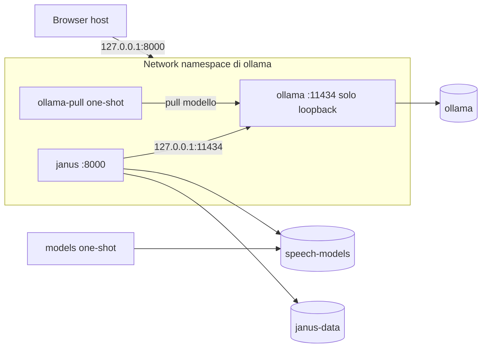
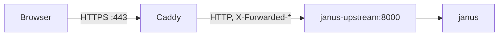

# Esecuzione con Docker Compose

Lo stack Compose avvia in un solo comando tutto ciò che serve a JANUS: server
LLM (Ollama), download dei modelli e backend/kiosk. Funziona su Linux e su
Windows/macOS con Docker Desktop. Il browser kiosk resta sull'host.

## Requisiti

- Docker Engine 20.10+ con il plugin Compose v2 (`docker compose`);
- accesso a Internet al primo avvio, per scaricare immagini e modelli;
- circa 10 GB di spazio con la configurazione predefinita: immagine
  `ollama/ollama` ~5,6 GB, `qwen3:4b-instruct` ~2,5 GB, modelli vocali ~0,6 GB,
  immagine JANUS ~0,65 GB;
- opzionale: GPU NVIDIA con
  [NVIDIA Container Toolkit](https://docs.nvidia.com/datacenter/cloud-native/container-toolkit/).

## Avvio rapido

Dalla root del repository:

```bash
docker compose up -d --build
```

Il primo avvio scarica il modello LLM e i modelli vocali, quindi può richiedere
diversi minuti. Gli avvii successivi riusano i volumi e partono in pochi
secondi. Quando `docker compose ps` mostra `janus` come `healthy`, aprire
`http://127.0.0.1:8000`.

Con GPU NVIDIA:

```bash
docker compose -f docker-compose.yml -f docker-compose.gpu.yml up -d --build
```

Arresto, conservando modelli, classifica e chiave:

```bash
docker compose down
```

## Servizi



| Servizio | Ruolo | Ciclo di vita |
| --- | --- | --- |
| `ollama` | Server LLM, pubblica anche la porta di JANUS | permanente |
| `ollama-pull` | Scarica `JANUS_LLM_MODEL` se assente | termina dopo il pull |
| `models` | Scarica faster-whisper e le voci Piper se assenti | termina dopo il download |
| `janus` | Backend FastAPI e frontend kiosk | permanente, healthcheck su `/api/health` |

`janus` parte solo dopo che `ollama` è sano e i due servizi one-shot sono
terminati con successo.

### Perché il namespace di rete condiviso

La configurazione applicativa accetta soltanto URL LLM su loopback
(`LLMSettings.endpoint_matches_provider`). Invece di allentare questo controllo, `janus`
usa `network_mode: service:ollama`: i due container condividono lo stesso
`127.0.0.1`, Ollama ascolta solo su loopback e non è raggiungibile né dall'host
né da altri container. Per lo stesso motivo la porta di JANUS è dichiarata sul
servizio `ollama`.

Effetto collaterale: se il container `ollama` viene ricreato, anche `janus`
va ricreato (`docker compose up -d` lo fa automaticamente).

## Scelta del backend LLM: Ollama o Hugging Face

Ollama locale è il default. Per usare invece Hugging Face Inference Providers:

```bash
docker compose -f docker-compose.yml -f docker-compose.hf.yml up -d --build
```

oppure, per renderlo il default di quella copia del repository, in `.env`:

```dotenv
COMPOSE_FILE=docker-compose.yml:docker-compose.hf.yml
HF_TOKEN=hf_...
HF_BILL_TO=my-org                                  # opzionale
JANUS_HF_MODEL=Qwen/Qwen3-4B-Instruct-2507:nscale  # opzionale
```

Con l'override HF i servizi `ollama` e `ollama-pull` non partono (nessun
download di immagine Ollama o pesi LLM), `janus` usa la rete bridge e pubblica
direttamente la propria porta, sempre su `127.0.0.1` per default. STT e TTS
restano locali. Se `HF_TOKEN` manca, Compose si ferma con un errore esplicito.

Per tornare a Ollama: `docker compose -f docker-compose.yml -f
docker-compose.hf.yml down`, quindi `docker compose up -d` (togliendo
`COMPOSE_FILE` da `.env` se impostato). Implicazioni su privacy e costi in
[SECURITY.md](SECURITY.md#inferenza-remota-hugging-face-opzionale).

## Modalità online su Internet

Per far giocare 10–50 persone da dispositivi propri, JANUS ha una modalità
online (`online.enabled`) con accesso tramite codice evento, sessioni legate al
giocatore, limiti e cancello sull'LLM. L'applicazione implementa le regole; il
proxy si occupa solo del TLS. Il modello di sicurezza è in
[SECURITY.md](SECURITY.md#modalità-online-internet).

### Variante A: Caddy nello stack

```bash
docker compose -f docker-compose.yml -f docker-compose.public.yml up -d --build
```

Per il resto di questa sezione i comandi `docker compose` (`ps`, `logs`, `cp`,
`up -d`) vanno dati con lo stesso elenco di `-f` dell'avvio, altrimenti
`janus` viene ricreato senza modalità online. Per non ripeterlo, in `.env`:

```dotenv
COMPOSE_FILE=docker-compose.yml:docker-compose.public.yml
# con HF o GPU: docker-compose.yml:docker-compose.hf.yml:docker-compose.public.yml
```

L'override si combina con gli altri:

```bash
# Hugging Face
docker compose -f docker-compose.yml -f docker-compose.hf.yml -f docker-compose.public.yml up -d --build
# GPU NVIDIA
docker compose -f docker-compose.yml -f docker-compose.gpu.yml -f docker-compose.public.yml up -d --build
```

Variabili in `.env`:

| Variabile | Default | Effetto |
| --- | --- | --- |
| `JANUS_PUBLIC_HOST` | obbligatoria | Nome DNS pubblico (solo hostname, es. `ctf.example.com`) |
| `JANUS_ACCESS_CODES` | obbligatoria | Codici evento separati da virgola, almeno 8 caratteri ciascuno |
| `JANUS_TLS` | `acme` | `acme`: certificato Let's Encrypt automatico; `internal`: CA locale di Caddy (test, reti chiuse) |
| `JANUS_HTTP_PORT` | `80` | Porta HTTP pubblicata da Caddy |
| `JANUS_HTTPS_PORT` | `443` | Porta HTTPS pubblicata da Caddy (TCP e UDP) |
| `JANUS_SUBNET` | `172.30.57.0/24` | Subnet della rete Compose |
| `JANUS_CADDY_IP` | `172.30.57.10` | Indirizzo fisso di Caddy; deve ricadere in `JANUS_SUBNET` |
| `CADDY_VERSION` | `2` | Tag dell'immagine `caddy` |

Requisiti:

- un record DNS (A/AAAA) per `JANUS_PUBLIC_HOST` che punti all'host;
- con `JANUS_TLS=acme` le porte pubbliche 80 e 443 devono essere raggiungibili
  da Internet (sfida ACME): `JANUS_HTTP_PORT` e `JANUS_HTTPS_PORT` diversi dai
  default servono solo con `JANUS_TLS=internal` o con porte rimappate a monte;
- con `JANUS_TLS=internal` il browser mostra un avviso finché non si installa
  la CA locale di Caddy.



Solo Caddy è pubblicato: la porta 8000 non è esposta sull'host. L'alias di rete
`janus-upstream` è definito su `ollama` (`docker-compose.yml`) o su `janus`
(`docker-compose.hf.yml`), a seconda di quale servizio possiede la porta di
JANUS. JANUS si fida di `X-Forwarded-*` solo dall'indirizzo fisso
`JANUS_CADDY_IP` (`JANUS_TRUSTED_PROXIES`), non dall'intera rete: gli altri
container non possono falsificare l'IP del client. Caddy limita il body a 25 MB
e il timeout di lettura a 120 s (`docker/Caddyfile`).

### Variante B: proxy o CDN esterno

JANUS viene pubblicato su un indirizzo interno e il proxy esterno termina il TLS.
Il file `docker-compose.proxy.yml` abilita la modalità online nel container
(`JANUS_ONLINE=1` e le tre variabili sotto) senza Caddy; la pubblicazione della
porta resta quella dei file base e HF (`JANUS_BIND_ADDRESS`, `JANUS_PORT`).
In `.env`:

```dotenv
JANUS_BIND_ADDRESS=10.0.0.5          # indirizzo interno raggiungibile dal proxy
JANUS_PUBLIC_HOST=ctf.example.com
JANUS_TRUSTED_PROXIES=10.0.0.2       # IP/CIDR del proxy (obbligatoria)
JANUS_ACCESS_CODES=codice-uno,codice-due
```

```bash
docker compose -f docker-compose.yml -f docker-compose.proxy.yml up -d --build
# con Hugging Face o GPU aggiungere -f docker-compose.hf.yml / -f docker-compose.gpu.yml
```

Se una delle tre variabili manca, Compose si ferma con un errore esplicito.
Come per Caddy, si può impostare
`COMPOSE_FILE=docker-compose.yml:docker-compose.proxy.yml` in `.env`.

Requisiti per il proxy:

- inoltrare `Host` e impostare `X-Forwarded-For` e `X-Forwarded-Proto: https`;
- limite sul body di almeno 20 MB (audio vocale);
- timeout di lettura di almeno 120 s (turni LLM lenti).

Senza `JANUS_TRUSTED_PROXIES` (con i file Compose forniti è obbligatoria) JANUS ignora gli header
inoltrati, vede ogni client come l'IP del proxy (rate limit condiviso da tutti)
e registra un avviso all'avvio. Un proxy sullo stesso host va elencato come gli
altri: altrimenti ogni client sembra locale ai limiti.

Esempio nginx:

```nginx
server {
    listen 443 ssl;
    server_name ctf.example.com;
    # ssl_certificate ... ; ssl_certificate_key ... ;

    client_max_body_size 25m;

    location / {
        proxy_pass http://10.0.0.5:8000;
        proxy_set_header Host $host;
        proxy_set_header X-Forwarded-For $proxy_add_x_forwarded_for;
        proxy_set_header X-Forwarded-Proto https;
        proxy_read_timeout 120s;
    }
}
```

### Capacità per backend

Il cancello globale sull'LLM (`llm.max_concurrent`, `llm.max_queue` in
`configs/app.yaml`, default 8 e 16) limita le chiamate simultanee; oltre la
coda JANUS risponde 503 `llm_busy` con `Retry-After`.

| Backend | Impostazione consigliata | Misura |
| --- | --- | --- |
| Hugging Face | `llm.max_concurrent` 8–16 | 8 giocatori concorrenti in 4,6 s complessivi, 0,7–3,6 s per turno |
| Ollama con GPU | `OLLAMA_NUM_PARALLEL` = `llm.max_concurrent` | non misurato |
| Ollama su CPU | sconsigliato oltre 2–3 giocatori | 4 giocatori: turni fino a 38,7 s (16 core, senza GPU) |

Per l'online si raccomanda Hugging Face o una GPU. Prima dell'evento provare il
carico con `scripts/online_load_test.py` (vedere
[EVENT_RUNBOOK.md](EVENT_RUNBOOK.md#evento-online)):

```bash
python scripts/online_load_test.py --base-url https://ctf.example.com --players 50
# con JANUS_TLS=internal (es. JANUS_HTTPS_PORT=8443), fidandosi della CA locale di Caddy:
docker compose -f docker-compose.yml -f docker-compose.public.yml \
  cp caddy:/data/caddy/pki/authorities/local/root.crt ./caddy-root.crt
python scripts/online_load_test.py --base-url https://127.0.0.1:8443 \
  --host-header ctf.example.com --ca-file ./caddy-root.crt --players 50
```

(`JANUS_ACCESS_CODES` viene letta dall'ambiente, oppure `--access-code`.)

### Rotazione dei codici e log

Per ruotare il codice evento aggiornare `JANUS_ACCESS_CODES` in `.env` e
rieseguire `docker compose -f docker-compose.yml -f docker-compose.public.yml up -d`
(con gli stessi `-f` di HF/GPU usati all'avvio, oppure `docker-compose.proxy.yml`
con proxy esterno; senza l'override `janus` torna senza modalità online). I log
di accesso di JANUS e di Caddy contengono IP e ID di sessione nei percorsi: il log
di accesso di JANUS si disattiva con `JANUS_ACCESS_LOG=0` in `.env` (CLI:
`--no-access-log`); per il resto si veda
[SECURITY.md](SECURITY.md#log-di-accesso-e-privacy).

## Configurazione

Compose legge un file `.env` nella root del repository. Tutte le variabili sono
facoltative; `.env.example` riporta l'elenco completo.

| Variabile | Default | Effetto |
| --- | --- | --- |
| `JANUS_MODE` | `stand` | `stand` oppure `score` (Arena) |
| `JANUS_LLM_PROVIDER` | `ollama` | `ollama` oppure `mock` (con `mock` Ollama resta attivo e il modello viene comunque scaricato) |
| `JANUS_LLM_MODEL` | `qwen3:4b-instruct` | Modello Ollama (anche `hf.co/<org>/<repo>-GGUF:<quant>`) |
| `JANUS_STT_PROVIDER` | `faster_whisper` | `faster_whisper` oppure `disabled` |
| `JANUS_STT_MODEL` | `small` | `tiny`, `base`, `small` o `medium` |
| `JANUS_TTS_PROVIDER` | `piper` | `piper` oppure `disabled` |
| `JANUS_PIPER_VOICE_IT` / `_EN` | `it_IT-paola-medium` / `en_US-lessac-medium` | Voci Piper |
| `HF_TOKEN` | vuoto | Token Hugging Face (solo override HF, obbligatorio) |
| `HF_BILL_TO` | vuoto | Organizzazione a cui addebitare l'inferenza HF |
| `JANUS_HF_MODEL` | `Qwen/Qwen3-4B-Instruct-2507` | Modello HF, eventualmente con `:operatore` |
| `JANUS_SECRET_KEY` | vuoto | Chiave HMAC; se vuota viene generata e salvata nel volume dati |
| `JANUS_BIND_ADDRESS` | `127.0.0.1` | Indirizzo host su cui pubblicare la porta |
| `JANUS_PORT` | `8000` | Porta host |
| `OLLAMA_VERSION` | `latest` | Tag dell'immagine `ollama/ollama` |
| `OLLAMA_KEEP_ALIVE` | `24h` | Tempo di permanenza del modello in memoria |
| `OLLAMA_NUM_PARALLEL` | `1` | Richieste LLM servite in parallelo |
| `JANUS_ONLINE` | `0` | `1` abilita la modalità online (impostata da `docker-compose.public.yml`) |
| `JANUS_ACCESS_LOG` | `1` | `0`, `false` o `no` disattiva il log di accesso di uvicorn (`--no-access-log`) |
| `JANUS_PUBLIC_HOST` | vuoto | Hostname pubblico (online; obbligatoria con gli override public e proxy) |
| `JANUS_ACCESS_CODES` | vuoto | Codici evento separati da virgola (online; obbligatoria con gli override public e proxy) |
| `JANUS_TRUSTED_PROXIES` | vuoto | IP/CIDR dei proxy di cui fidarsi per `X-Forwarded-*` (obbligatoria con l'override proxy; impostata da public) |
| `JANUS_TLS` | `acme` | `acme` oppure `internal` (override public) |
| `JANUS_HTTP_PORT` / `JANUS_HTTPS_PORT` | `80` / `443` | Porte pubblicate da Caddy |
| `JANUS_SUBNET` / `JANUS_CADDY_IP` | `172.30.57.0/24` / `172.30.57.10` | Subnet Compose e indirizzo fisso di Caddy |
| `CADDY_VERSION` | `2` | Tag dell'immagine `caddy` |

Dopo aver cambiato modello o voci è sufficiente `docker compose up -d`: i
servizi one-shot scaricano solo ciò che manca.

Le opzioni `--mode`, `--llm-*` ecc. della CLI sono generate dall'entrypoint a
partire da queste variabili (`docker/entrypoint.sh`).

## Dati e volumi

| Volume | Contenuto |
| --- | --- |
| `janus_ollama` | Modelli Ollama |
| `janus_speech-models` | faster-whisper e voci Piper (montato read-only in `janus`) |
| `janus_janus-data` | SQLite, chiave HMAC `janus.key`, audio temporaneo |

Per un evento Score la chiave deve restare stabile: non eliminare
`janus_janus-data` né cambiare `JANUS_SECRET_KEY` a evento in corso.
`docker compose down -v` elimina **tutti** i volumi, inclusi classifica e
modelli.

Backup della classifica:

```bash
docker compose cp janus:/data/janus.sqlite3 ./janus-backup.sqlite3
```

## Hardening del container

Il container `janus` gira come utente non privilegiato (UID 10001), con root
filesystem read-only, `/tmp` in tmpfs, tutte le capability rimosse e
`no-new-privileges`. A runtime è impostato `HF_HUB_OFFLINE=1`: i modelli vengono
scaricati solo dal servizio `models`.

## Esposizione in rete

Per impostazione predefinita la porta è pubblicata solo su `127.0.0.1`, in
linea con il modello di sicurezza kiosk. Impostare `JANUS_BIND_ADDRESS=0.0.0.0`
rende JANUS raggiungibile dalla rete, ma senza modalità online l'applicazione non
ha autenticazione né rate limiting e `TrustedHostMiddleware` accetta solo gli
host di `configs/app.yaml`: valutare [SECURITY.md](SECURITY.md) prima di farlo.
Per l'esposizione su Internet usare la modalità online descritta sopra.

## Diagnostica

```bash
docker compose ps
docker compose logs -f janus
docker compose exec janus python -c "import urllib.request; print(urllib.request.urlopen('http://127.0.0.1:8000/api/health').read().decode())"
```

| Sintomo | Causa probabile |
| --- | --- |
| `ollama-pull` termina con errore | Nome modello errato o rete assente |
| `models` termina con errore | Download Hugging Face fallito; rilanciare `docker compose up -d` |
| `janus` resta `unhealthy` | Leggere `components` in `/api/health` |
| Risposte molto lente su CPU | Usare un modello più piccolo o il profilo GPU |

Riferimento misurato su CPU (16 core, senza GPU) con `qwen3:4b-instruct`: turno
testuale 11-15 s, turno vocale con STT `small` circa 12 s. Con Hugging Face
(`Qwen/Qwen3-4B-Instruct-2507:nscale`) la sola inferenza richiede 1-2 s.
