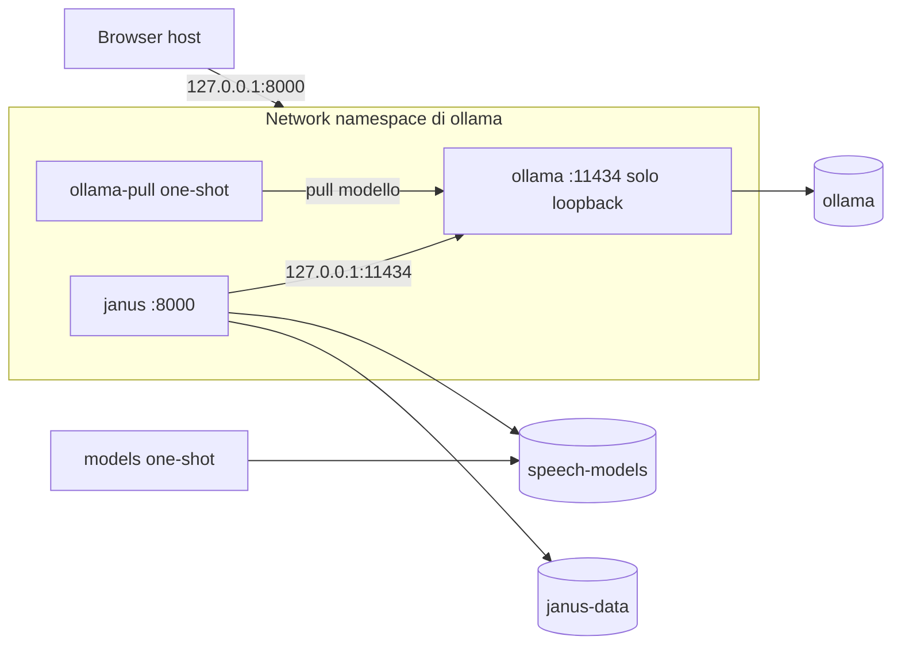

# Esecuzione con Docker Compose

Lo stack Compose avvia in un solo comando tutto ciò che serve a JANUS: server
LLM (Ollama), download dei modelli e backend/kiosk. Funziona su Linux e su
Windows/macOS con Docker Desktop. Il browser kiosk resta sull'host.

## Requisiti

- Docker Engine 20.10+ con il plugin Compose v2 (`docker compose`);
- accesso a Internet al primo avvio, per scaricare immagini e modelli;
- circa 10 GB di spazio con la configurazione predefinita: immagine
  `ollama/ollama` ~5,6 GB, `qwen3:4b-instruct` ~2,5 GB, modelli vocali ~0,6 GB,
  immagine JANUS ~0,65 GB;
- opzionale: GPU NVIDIA con
  [NVIDIA Container Toolkit](https://docs.nvidia.com/datacenter/cloud-native/container-toolkit/).

## Avvio rapido

Dalla root del repository:

```bash
docker compose up -d --build
```

Il primo avvio scarica il modello LLM e i modelli vocali, quindi può richiedere
diversi minuti. Gli avvii successivi riusano i volumi e partono in pochi
secondi. Quando `docker compose ps` mostra `janus` come `healthy`, aprire
`http://127.0.0.1:8000`.

Con GPU NVIDIA:

```bash
docker compose -f docker-compose.yml -f docker-compose.gpu.yml up -d --build
```

Arresto, conservando modelli, classifica e chiave:

```bash
docker compose down
```

## Servizi



| Servizio | Ruolo | Ciclo di vita |
| --- | --- | --- |
| `ollama` | Server LLM, pubblica anche la porta di JANUS | permanente |
| `ollama-pull` | Scarica `JANUS_LLM_MODEL` se assente | termina dopo il pull |
| `models` | Scarica faster-whisper e le voci Piper se assenti | termina dopo il download |
| `janus` | Backend FastAPI e frontend kiosk | permanente, healthcheck su `/api/health` |

`janus` parte solo dopo che `ollama` è sano e i due servizi one-shot sono
terminati con successo.

### Perché il namespace di rete condiviso

La configurazione applicativa accetta soltanto URL LLM su loopback
(`LLMSettings.endpoint_matches_provider`). Invece di allentare questo controllo, `janus`
usa `network_mode: service:ollama`: i due container condividono lo stesso
`127.0.0.1`, Ollama ascolta solo su loopback e non è raggiungibile né dall'host
né da altri container. Per lo stesso motivo la porta di JANUS è dichiarata sul
servizio `ollama`.

Effetto collaterale: se il container `ollama` viene ricreato, anche `janus`
va ricreato (`docker compose up -d` lo fa automaticamente).

## Scelta del backend LLM: Ollama o Hugging Face

Ollama locale è il default. Per usare invece Hugging Face Inference Providers:

```bash
docker compose -f docker-compose.yml -f docker-compose.hf.yml up -d --build
```

oppure, per renderlo il default di quella copia del repository, in `.env`:

```dotenv
COMPOSE_FILE=docker-compose.yml:docker-compose.hf.yml
HF_TOKEN=hf_...
HF_BILL_TO=my-org                                  # opzionale
JANUS_HF_MODEL=Qwen/Qwen3-4B-Instruct-2507:nscale  # opzionale
```

Con l'override HF i servizi `ollama` e `ollama-pull` non partono (nessun
download di immagine Ollama o pesi LLM), `janus` usa la rete bridge e pubblica
direttamente la propria porta, sempre su `127.0.0.1` per default. STT e TTS
restano locali. Se `HF_TOKEN` manca, Compose si ferma con un errore esplicito.

Per tornare a Ollama: `docker compose -f docker-compose.yml -f
docker-compose.hf.yml down`, quindi `docker compose up -d` (togliendo
`COMPOSE_FILE` da `.env` se impostato). Implicazioni su privacy e costi in
[SECURITY.md](SECURITY.md#inferenza-remota-hugging-face-opzionale).

## Configurazione

Compose legge un file `.env` nella root del repository. Tutte le variabili sono
facoltative; `.env.example` riporta l'elenco completo.

| Variabile | Default | Effetto |
| --- | --- | --- |
| `JANUS_MODE` | `stand` | `stand` oppure `score` (Arena) |
| `JANUS_LLM_PROVIDER` | `ollama` | `ollama` oppure `mock` (con `mock` Ollama resta attivo e il modello viene comunque scaricato) |
| `JANUS_LLM_MODEL` | `qwen3:4b-instruct` | Modello Ollama (anche `hf.co/<org>/<repo>-GGUF:<quant>`) |
| `JANUS_STT_PROVIDER` | `faster_whisper` | `faster_whisper` oppure `disabled` |
| `JANUS_STT_MODEL` | `small` | `tiny`, `base`, `small` o `medium` |
| `JANUS_TTS_PROVIDER` | `piper` | `piper` oppure `disabled` |
| `JANUS_PIPER_VOICE_IT` / `_EN` | `it_IT-paola-medium` / `en_US-lessac-medium` | Voci Piper |
| `HF_TOKEN` | vuoto | Token Hugging Face (solo override HF, obbligatorio) |
| `HF_BILL_TO` | vuoto | Organizzazione a cui addebitare l'inferenza HF |
| `JANUS_HF_MODEL` | `Qwen/Qwen3-4B-Instruct-2507` | Modello HF, eventualmente con `:operatore` |
| `JANUS_SECRET_KEY` | vuoto | Chiave HMAC; se vuota viene generata e salvata nel volume dati |
| `JANUS_BIND_ADDRESS` | `127.0.0.1` | Indirizzo host su cui pubblicare la porta |
| `JANUS_PORT` | `8000` | Porta host |
| `OLLAMA_VERSION` | `latest` | Tag dell'immagine `ollama/ollama` |
| `OLLAMA_KEEP_ALIVE` | `24h` | Tempo di permanenza del modello in memoria |
| `OLLAMA_NUM_PARALLEL` | `1` | Richieste LLM servite in parallelo |

Dopo aver cambiato modello o voci è sufficiente `docker compose up -d`: i
servizi one-shot scaricano solo ciò che manca.

Le opzioni `--mode`, `--llm-*` ecc. della CLI sono generate dall'entrypoint a
partire da queste variabili (`docker/entrypoint.sh`).

## Dati e volumi

| Volume | Contenuto |
| --- | --- |
| `janus_ollama` | Modelli Ollama |
| `janus_speech-models` | faster-whisper e voci Piper (montato read-only in `janus`) |
| `janus_janus-data` | SQLite, chiave HMAC `janus.key`, audio temporaneo |

Per un evento Score la chiave deve restare stabile: non eliminare
`janus_janus-data` né cambiare `JANUS_SECRET_KEY` a evento in corso.
`docker compose down -v` elimina **tutti** i volumi, inclusi classifica e
modelli.

Backup della classifica:

```bash
docker compose cp janus:/data/janus.sqlite3 ./janus-backup.sqlite3
```

## Hardening del container

Il container `janus` gira come utente non privilegiato (UID 10001), con root
filesystem read-only, `/tmp` in tmpfs, tutte le capability rimosse e
`no-new-privileges`. A runtime è impostato `HF_HUB_OFFLINE=1`: i modelli vengono
scaricati solo dal servizio `models`.

## Esposizione in rete

Per impostazione predefinita la porta è pubblicata solo su `127.0.0.1`, in
linea con il modello di sicurezza kiosk. Impostare `JANUS_BIND_ADDRESS=0.0.0.0`
rende JANUS raggiungibile dalla rete, ma l'applicazione non ha autenticazione né
rate limiting e `TrustedHostMiddleware` accetta solo gli host di
`configs/app.yaml`: valutare [SECURITY.md](SECURITY.md) prima di farlo.

## Diagnostica

```bash
docker compose ps
docker compose logs -f janus
docker compose exec janus python -c "import urllib.request; print(urllib.request.urlopen('http://127.0.0.1:8000/api/health').read().decode())"
```

| Sintomo | Causa probabile |
| --- | --- |
| `ollama-pull` termina con errore | Nome modello errato o rete assente |
| `models` termina con errore | Download Hugging Face fallito; rilanciare `docker compose up -d` |
| `janus` resta `unhealthy` | Leggere `components` in `/api/health` |
| Risposte molto lente su CPU | Usare un modello più piccolo o il profilo GPU |

Riferimento misurato su CPU (16 core, senza GPU) con `qwen3:4b-instruct`: turno
testuale 11-15 s, turno vocale con STT `small` circa 12 s. Con Hugging Face
(`Qwen/Qwen3-4B-Instruct-2507:nscale`) la sola inferenza richiede 1-2 s.
